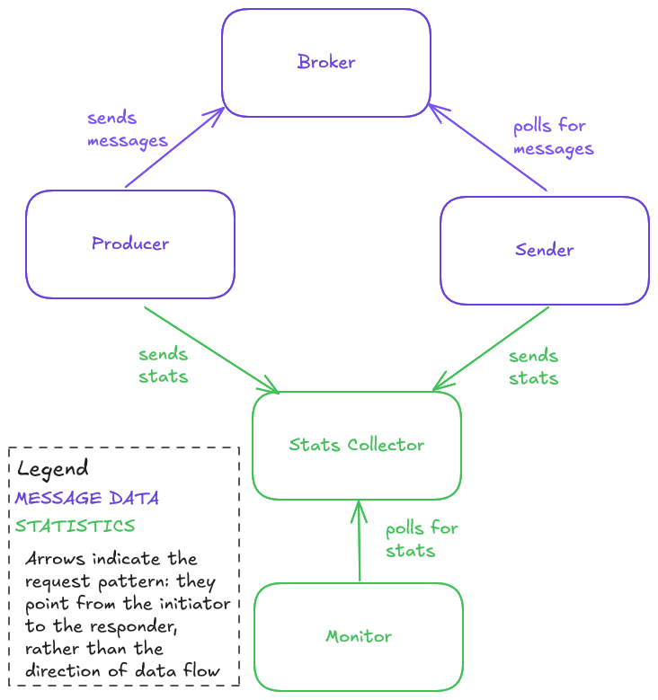
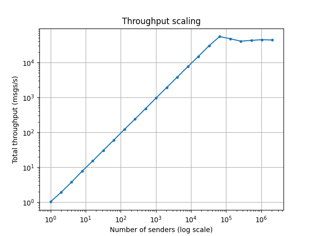
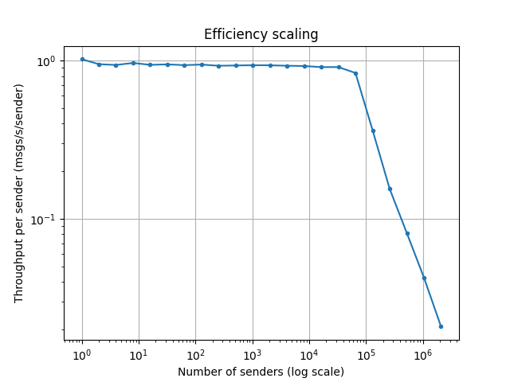
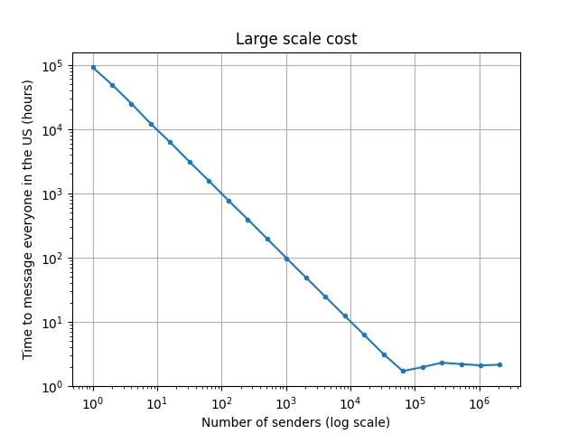

# SMS Alert Simulation
This simulates a system for sending many SMS alerts. It must include producer processes that create SMS messages and sender processes that send them. For the purposes of this simulation, "sending" a message simply means sleeping for some amount of time. The project requirements specified that the system must be scalable, but left the precise target for scaling open-ended.

To simplify building and running the system, it primarily uses Python standard library components, but this document indicates a few components that might be replaced by off-the-shelf parts in a larger-scale distrubuted version.

## Overall Design

The system consists of 5 components, shown in the diagram above and documented in detail in their own sections below.
1. **Message Broker**: Responsible for moving messages between producers and senders.
2. **Producer**: Generates random messages and sends them to the broker.
3. **Sender**: Polls the broker for new messages and sends them one-by-one.
4. **Stats Collector**: Service that receives statistics from the other components, such as the number of messages sent.
5. **Monitor**: Periodically requests the most recent system statistics and logs them.

## Asyncio and Scalability tests
Because I expect most of the work for this system to involve waiting on blocking IO rather than computation (`sleep` in this case), my initial thought was to use Python asyncio with coroutines. I expected this to allow the system to initiate many simulataneous `send` requests with minimal overhead.

To validate this approach before designing the whole system around it, I first created a very crude version of the proposed system to run a quick-and-dirty scalability test. This code is entirely contained in `quick_test.py`. This experiment used an `asyncio.Queue` as the message broker, and `asyncio.Task`s for the producer and senders. I configured the mean send time to be 1 second with a standard deviation of 0.1 seconds.

In the experiment I varied the number of concurrent senders and measured the overall throughput. The number of messages sent was 10 times the number of senders. The figures below show the results of this experiment.

*The overall throughput as the number of senders is increased. Note the log-log scale. Throughput increases linearly until about 50e3 senders, at which point it levels off. The results show that there is no throughput collapse through abotu 2e6 senders, suggesting that it will not be necessary to carefully tune that parameter: just set it to something reasonably large and forget about it.*

*Per-sender throughput as the number of senders is increased. Note the log-log scale. Per-sender throughput is constant, and just barely below 1 msg per second from 1 sender through about 50e3 senders. After that it drops off quickly. The fact that it is just barely below 1 (the configured mean send time) inidcates that the system is getting good efficiency for all of these parameter settings: almost all of a sender's time is spent sending messages, and not doing other things.*

*This chart shows the time to send a message to everyone in the United States. The US population is abotu 340 million, so this is really just another way of presenting the data from the first chart, however, it gives some understanding of what kind of scale we're talking about with this design: With 50 thousand senders it would take about 2 hours to message everyone in the US. That's probably good enough for many applications, but maybe not for something like an emergency alert system. For reference, at this throughput it would take about 2 minutes to message everyone in the state of Massachusetts.*

## Batching
When hitting the scalability limit, the CPU on my computer was running continuously at 100%. This suggests that scaling beyond 50e3 senders would require distributing over multiple processes, either on the same machine or multiple machines.

The current implementation is not distributed, but I wanted to design the system with that in mind. As such, the basic unit of communication between the broker and the other components is not a single message, but a batch of messages. In a distributed application where communicating with the broker involves an RPC, I expect this to reduce RPC overhead and improve the system's scalability.

## System Components
This section gives implementation details for the major system componets, and talks about how they could be modified to scale the system up farther.

### Broker
The broker is implemented in the class `broker.MessageBroker` in `broker.py`. It is currently based on an `asyncio.Queue` with a configurable maximum size. The interface for the broker is 3 methods:
1. `put_batch` sends a batch of messages to the broker. It blocks if the queue is at its maximum size.
2. `get_batch` retrieves a batch of messages. If the broker is in a shutdown state *and* there are no pending batches, this returns None. if there are not pending messages but the queue is not in a shutdown state, it blocks until there are messages to return.
3. `shutdown` puts the queue in a shutdown state. Subsequent calls to `put_batch` will fail. Subsequent calls to `get_batch` will succeed until the queue is empty, and then will return None.

In a larger-scale implementation of this system the broker would be the central communication point for the other components. This could be based on a message queue like Kafka/Redpanda or Redis, or could be a custom sytem, depending on the requirements.

### Producer
The producer is implemented in `producer.SmsMessageProducer` in the file `producer.py`. The main interface to the producer is a single method, `send_multiple_batches(self, batch_count: int, batch_size: int)` that sends a number of batches asynchrously. As it sends batches it also logs them to the Stats Collector so they can be displayed in the monitor.

### Sender
The sender is implemented by the class `sender.Sender` in `sender.py`. Its main interface is `consume_messages` which polls the broker for message batches until the queue is drained, indicated by `broker.get_batch()` returning `None`.

### Stats Collector
The stats collector is implemented in `stats_collector.StatsCollector` in the file `stats_collector.py`. One design consideration for the stats collector is that it should be relatively simple: it simply collects stats from other systems without doing any kind of computation or interpretation on them. In a larger-scale version of this system, it could use a distributed telemetry service like Datadog as a backend. To support this, the interface for the stats collector is entirely async, even though none of the methods are doing anything asynchronously.

The write interface for the stats collector consists of specialied methods for the different stats being collected:
1. `log_produced`
2. `log_dequeued`
3. `log_sent`
4. `log_failed`

The read interface is a single method that returns a `MessagingStats` data class:
1. `get_stats() -> MessagingStats`

### Monitor
Class `monitor.Monitor` in file `monitor.py`. This class has a `run` method that starts an async task. That task runs forever, polling the Stats Collector and printing the results. It is expected that some external code will call `cancel()` on that task to stop it when it is time to shut down.

In a larger-scale version of the system, there could be multiple monitors with different purposes: a web-based gui could show real-time graphs to users, an alerting system could trigger alerts due to anomalous behavior, such as no messages sent even when there are pending messages in the queue, and a historical logger could save summary statistics to a log file.

### Application
The class `application.Application` in `application.py` ties these all together. It creates instances of the different components, starts the async tasks, waits for them to finish, and finally cancels the monitor task.
